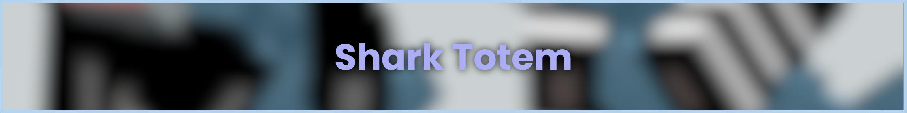

# 🦈 Shark

A Minecraft mod that changes the totem of undying to be a shark.

| Item | Preview |
|---|---|
| Light Blue Shark |  |
| Gray Shark |  | 
| Blue Whale |  |

# 🚀 Installation

<h3>Download the mod via releases or by compiling it your self.</h3>

Also download the ``shark resourcepacks.zip`` for the shark textures, there are 3 versions a ``blue whale``, a ``gray shark``, and a normal ``light blue shark``

## Building
	cd platform-${loader}-${version}
	./gradlew build

## 🎁 Credits

Original Idea and models by [hibi](https://modrinth.com/user/hibi).
 
I just made it replace the totem instead of adding a custom item.

## License

This mod is licensed under the [Unlicense](./LICENSE). Feel free to learn from it and incorporate it in your own projects.

The icon of this project is the Blobhaj by Heatherhorns, and is licensed under a [Creative Commons Attribution 4.0 International License](http://creativecommons.org/licenses/by/4.0/).
